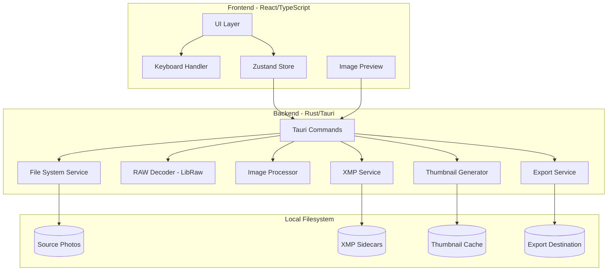
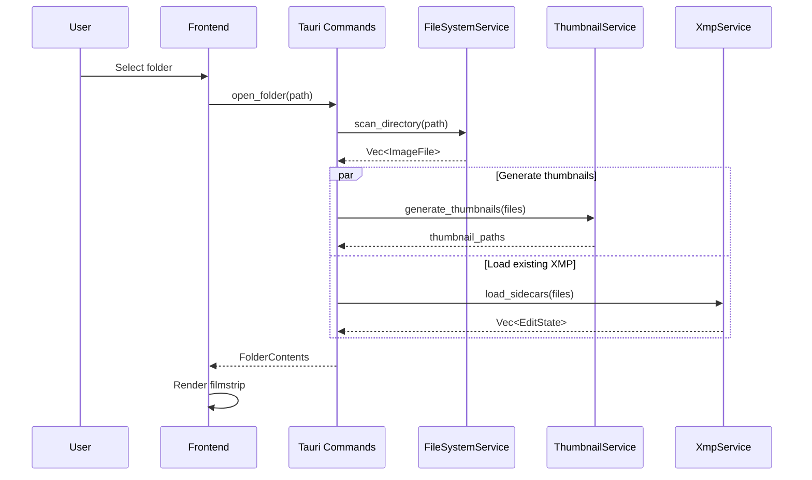
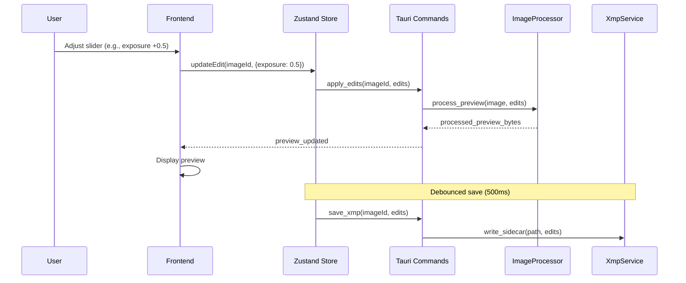
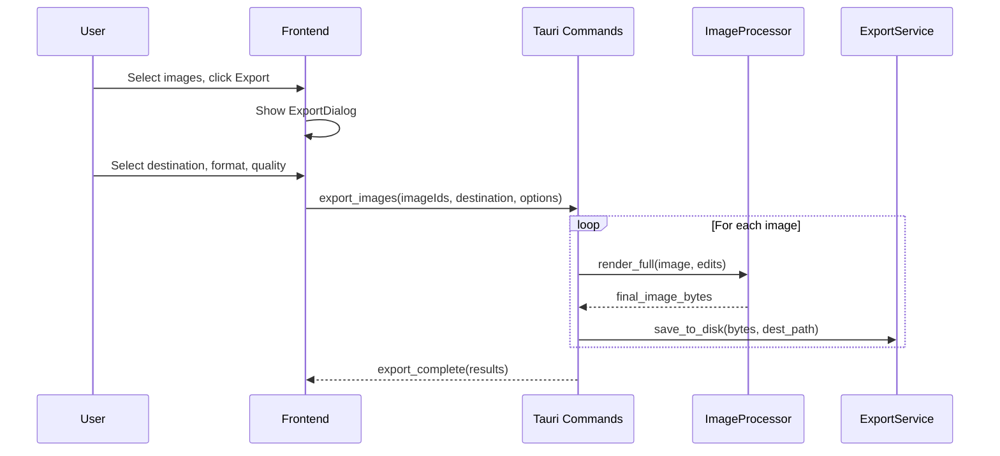

# PhotoCull Architecture

## Metadata
- Version: 1.0
- Last Updated: 2025-01-27
- Depends On: None (root document)
- Breaking Changes: No

---

## 1. Overview

PhotoCull is a local, offline desktop application for fast photo culling and light editing with non-destructive XMP sidecar support.

**Tech Stack Decision:**

| Layer | Choice | Rationale |
|-------|--------|-----------|
| Framework | **Tauri 2.0** | Small binary (~10MB vs Electron's 150MB+), native performance, secure by default |
| Frontend | **React + TypeScript** | Mature ecosystem, excellent keyboard handling, fast dev iteration |
| Backend | **Rust** | Memory-safe, fast image processing, excellent concurrency |
| RAW Processing | **LibRaw** (via libraw-rs) | Industry standard, supports 1000+ camera models |
| Image Processing | **image** + **imageproc** crates | Pure Rust, no external deps for basic ops |
| XMP | **Custom parser** (quick-xml) | XMP is simple XML; avoid heavy deps |
| UI Components | **Radix UI** + **Tailwind CSS** | Accessible, keyboard-friendly, fast styling |

---

## 2. System Architecture



---

## 3. Component Responsibilities

### 3.1 Frontend Components

| Component | Responsibility |
|-----------|----------------|
| **FilmStrip** | Horizontal thumbnail strip, selection state |
| **MainPreview** | Large image display with zoom/pan |
| **EditPanel** | Sliders for exposure, contrast, WB, etc. |
| **RatingBar** | Star ratings (1-5), Pick/Reject flags |
| **KeyboardHandler** | Global hotkeys for all operations |
| **ExportDialog** | Destination folder picker, format options |

### 3.2 Backend Services

| Service | Responsibility |
|---------|----------------|
| **FileSystemService** | Scan folders, watch for changes, list supported files |
| **RawDecoder** | Decode RAW files (CR2, NEF, ARW, RAF, ORF, DNG, etc.) |
| **ImageProcessor** | Apply adjustments (non-destructive pipeline) |
| **XmpService** | Read/write XMP sidecar files |
| **ThumbnailService** | Generate and cache thumbnails |
| **ExportService** | Render final images to destination |

---

## 4. Data Flow

### 4.1 Opening a Folder



### 4.2 Editing an Image



### 4.3 Export Flow



---

## 5. Edit Pipeline (Non-Destructive)

Edits are applied in a fixed order for consistency:

```
1. RAW Decode (demosaic, initial color)
   ↓
2. White Balance adjustment
   ↓
3. Exposure adjustment
   ↓
4. Contrast adjustment
   ↓
5. Saturation / Vibrance
   ↓
6. Sharpening
   ↓
7. Crop & Straighten
   ↓
8. Rotate (90° increments)
   ↓
9. Output (preview or export)
```

**Edit State Schema:**

```rust
struct EditState {
    // Rating & Culling
    rating: u8,           // 0-5 stars
    flag: Flag,           // None, Pick, Reject
    
    // Geometry
    crop: Option<CropRect>,
    straighten_angle: f32, // -45.0 to +45.0 degrees
    rotation: Rotation,    // None, CW90, CW180, CW270
    
    // Tone
    exposure: f32,         // -5.0 to +5.0 EV
    contrast: f32,         // -100 to +100
    
    // Color
    white_balance_temp: f32,  // 2000K to 50000K
    white_balance_tint: f32,  // -150 to +150
    saturation: f32,          // -100 to +100
    vibrance: f32,            // -100 to +100
    
    // Detail
    sharpening_amount: f32,   // 0 to 150
    sharpening_radius: f32,   // 0.5 to 3.0
}
```

---

## 6. XMP Sidecar Format

Standard Adobe-compatible XMP stored as `{filename}.xmp`:

```xml
<?xml version="1.0" encoding="UTF-8"?>
<x:xmpmeta xmlns:x="adobe:ns:meta/">
  <rdf:RDF xmlns:rdf="http://www.w3.org/1999/02/22-rdf-syntax-ns#">
    <rdf:Description
      xmlns:xmp="http://ns.adobe.com/xap/1.0/"
      xmlns:crs="http://ns.adobe.com/camera-raw-settings/1.0/"
      xmp:Rating="3"
      crs:Exposure2012="+0.50"
      crs:Contrast2012="+10"
      crs:Temperature="5500"
      crs:Tint="+5"
      crs:Saturation="+15"
      crs:Vibrance="+20"
      crs:Sharpness="40"
      crs:CropTop="0.1"
      crs:CropLeft="0.05"
      crs:CropBottom="0.9"
      crs:CropRight="0.95"
      crs:CropAngle="2.5"
      crs:Orientation="1">
    </rdf:Description>
  </rdf:RDF>
</x:xmpmeta>
```

---

## 7. Supported File Formats

| Category | Extensions |
|----------|------------|
| RAW | CR2, CR3, NEF, NRW, ARW, SRF, SR2, RAF, ORF, RW2, DNG, PEF, ERF, 3FR, FFF, IIQ, RWL, SRW |
| Standard | JPG, JPEG, PNG, TIFF, TIF, HEIC, HEIF, WEBP |

---

## 8. Keyboard Shortcuts (MVP)

| Key | Action |
|-----|--------|
| `←` / `→` | Previous / Next image |
| `1-5` | Set rating |
| `P` | Pick flag |
| `X` | Reject flag |
| `U` | Unflag |
| `R` | Rotate CW 90° |
| `Shift+R` | Rotate CCW 90° |
| `C` | Enter crop mode |
| `Enter` | Confirm crop |
| `Esc` | Cancel / Exit mode |
| `Space` | Toggle zoom (fit / 100%) |
| `Ctrl+E` | Export selected |
| `Ctrl+O` | Open folder |

---

## 9. Directory Structure

```
PhotoCull/
├── src-tauri/           # Rust backend
│   ├── src/
│   │   ├── main.rs
│   │   ├── commands/    # Tauri command handlers
│   │   ├── services/    # Business logic
│   │   │   ├── filesystem.rs
│   │   │   ├── raw_decoder.rs
│   │   │   ├── image_processor.rs
│   │   │   ├── xmp.rs
│   │   │   ├── thumbnail.rs
│   │   │   └── export.rs
│   │   └── models/      # Data structures
│   ├── Cargo.toml
│   └── tauri.conf.json
├── src/                 # React frontend
│   ├── components/
│   │   ├── FilmStrip/
│   │   ├── MainPreview/
│   │   ├── EditPanel/
│   │   ├── RatingBar/
│   │   └── ExportDialog/
│   ├── hooks/
│   ├── store/           # Zustand store
│   ├── lib/
│   ├── App.tsx
│   └── main.tsx
├── package.json
├── tsconfig.json
├── vite.config.ts
└── tailwind.config.js
```

---

## 10. Risks and Mitigations

| Risk | Severity | Mitigation |
|------|----------|------------|
| LibRaw fails on exotic RAW format | Medium | Graceful fallback to embedded JPEG preview; log unsupported files |
| Large RAW files cause UI lag | High | Process in background thread; show loading state; use thumbnail for filmstrip |
| XMP write corrupts existing data | High | Read-modify-write pattern; backup before write; validate XML |
| Memory exhaustion with many files | Medium | Load thumbnails on-demand; limit concurrent full-res loads |
| Tauri security sandbox blocks file access | Low | Use Tauri's fs plugin with user-selected paths only |

---

## 11. MVP Scope Boundaries

**In Scope:**
- Open folder, scan images
- Thumbnail generation and filmstrip
- Full-resolution preview
- Rating (1-5 stars)
- Pick/Reject flags
- Basic edits: exposure, contrast, WB, saturation, vibrance, sharpening
- Crop and straighten
- Rotate 90°
- XMP sidecar read/write
- Export to destination folder (JPEG)

**Out of Scope (v2+):**
- Catalog/database
- Folders panel / library view
- Undo/redo history
- Batch editing
- Presets
- Tone curve
- HSL adjustments
- Lens corrections
- Export formats beyond JPEG
- Print
- Slideshows
- Cloud anything

---

## 12. Architecture Decisions Log

| Decision | Options Considered | Choice | Rationale |
|----------|-------------------|--------|-----------|
| Framework | Electron, Tauri, Qt, .NET | Tauri 2.0 | 10x smaller binary, Rust safety, modern |
| RAW decoder | dcraw, LibRaw, rawloader | LibRaw | Most camera support, battle-tested |
| State management | Redux, Zustand, Jotai | Zustand | Simple, minimal boilerplate, fast |
| Sidecar format | Custom JSON, XMP | XMP | Adobe-compatible, industry standard |
| UI styling | CSS Modules, styled-components, Tailwind | Tailwind | Fast iteration, small bundle |

---

## Metadata
- Version: 1.0
- Last Updated: 2025-01-27
- Depends On: None
- Breaking Changes: No
